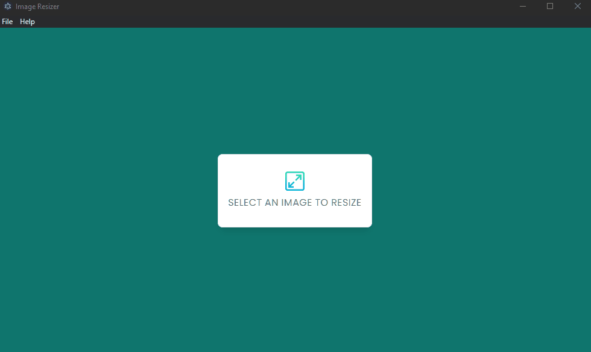

<h1 align="center">
 Image Resizer
</h1>

<p align="center">
  <a href="#about">About</a>&nbsp;&nbsp;&nbsp;|&nbsp;&nbsp;&nbsp;
  <a href="#Features">Features</a>&nbsp;&nbsp;&nbsp;|&nbsp;&nbsp;&nbsp;
  <a href="#Technologies">Technologies</a>&nbsp;&nbsp;&nbsp;|&nbsp;&nbsp;&nbsp;
  <a href="#Learned">License</a>
</p>

---

<p align="center">
  
</p>

---

<br>
<details align = "left">
<summary> <b> Summary of the Contents </b> <i>(Click here to Expand it!)</i> </summary>
 <br>

<!--ts-->

- About
- Features
  - Resize your Images
- Technologies
- Installing and Contributing
- What have i learned?
- License
- Contributors
- Author
  <!--te-->
   </details

<br>
<br>


<h2 id ="about" align="center">📌 About</h2>

**Image Resizer** is an Small App that enables you to Resize your images.

---

> Do you want to have a **Small Version of a photo? or a Bigger One?**, no problem!. With this App you can **Customize your image Size**.

<h2 id="Features" align="center">⚙️ Features</h2>

<h3> 🧷 Resize your Images</h3>

- On the Menu, **Choose your File** and fill in the **New Width and Height fields**.
<br>
 
 ---


<h2 id="Technologies" align="center">💻 Technologies</h2>

In this project it was utilized: <i>**Javascript, Electron, Node**</i><br><br>

- <i>**JavaScript**</i> - The **Programming Language**.<br>
- <i>**ElectronJS**</i> - The Framework that enables building **Desktop Apps**.<br>
- <i>**NodeJS**</i> - The Functions for **Interacting with Directories and Files**.<br>


<h2 align="center"> 📦 Installing and Contributing</h2>
  
To get started, fork the repository and then run the following commands:

1. Install NPM packages

```sh
npm install
```

2. Start the Local App

```sh
npm run start
```

<br>

Contributions are what make the open source community such an amazing place to learn, inspire, and create. Any contributions you make are **greatly appreciated**.
</br></br>
✏️ To contribute, do the following:

1. Fork the Project
2. Create your Feature Branch. (`git checkout -b feature/AmazingFeature`)
3. Commit your Changes. (`git commit -m 'Adding some AmazingFeature'`)
4. Push to the Branch. (`git push origin feature/AmazingFeature`)
5. Open a Pull Request

<h2 id="Learned" align="center">☕ What have i learned?</h2>

> This Project was my first introduction to Electron JS, and with this i could learn the **Basics** of how to **Setup an Electron Configuration from the Ground up without Boilerplates**.

## 📝 License

Distributed under the **MIT** License.

## 🤝 Contributors

Thanks to the following people who contributed to this project in some way:
<br><br>
<b>Nobody yet, see something that you want to improve on this project? Share it with me!.<b/>

<!--<table>
  <tr>
    <td align="center">
      <a href="">
        <!--<br>
        <sub>
          <b></b>
        </sub>
      </a>
    </td>
  </tr>
</table>-->

<h2>Author</h2>

Made with 💜 and dedication by me **Guilherme G Cadilhe** Aka: **Bobnini**. <br>

<h2>Acknowledgments</h2>

Used resources:

- [TraversyMedia](https://www.youtube.com/@TraversyMedia)
